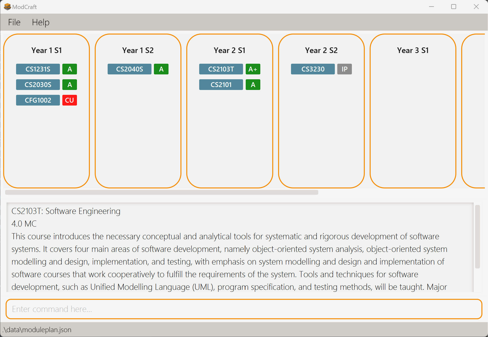

--- 
  layout: default.md
  title: "User Guide"
  pageNav: 3
---

# ModCraft User Guide

ModCraft is an app that provides a fast and easy way for students to track courses
to take to meet graduation requirements and plan courses to take. The user interacts
with it using a CLI, and it has a GUI created with JavaFX.

<!-- * Table of Contents -->
<page-nav-print />

--------------------------------------------------------------------------------------------------------------------
## Table of Contents
* [Quick start](#quick-start)
* [Features](#features)
* [FAQ](#faq)
* [Known issues](#known-issues)
* [Command summary](#command-summary)
--------------------------------------------------------------------------------------------------------------------

## Quick start

1. Ensure you have Java 11 or above installed in your Computer.
    1. To do this, open a command terminal and type `java --version`.
    2. If you do not have Java 11 installed, get it [here](https://www.oracle.com/sg/java/technologies/javase/jdk11-archive-downloads.html).

2. Download the latest `ModCraft.jar` from [here](https://github.com/AY2324S1-CS2103T-T13-0/tp/releases/tag/v1.2b).

3. Copy the file to the folder you want to use as the _home folder_ for your ModCraft.

4. Open a command terminal, `cd` into the folder you put the jar file in, and use the `java -jar ModCraft.jar` command to run the application. 
   A GUI similar to the below should appear in a few seconds. Note how the app contains some sample data.   
   

5. Type the command in the command box and press Enter to execute it. e.g. typing **`help`** and pressing Enter will open the help window. 
   Some example commands you can try:

    * `info CS1101S` : Shows Information about the module CS1101S

    * `add CS2030S y/1 s/2 g/IP` : Adds the module CS2030S to semester 2 in year 1, and marks it as In Progress.

    * `delete CS2040S` : Deletes the module CS2040S if present from the list of modules taken

    * `exit` : Exits the app.

6. Refer to the [Features](#features) section below for details of each command.

--------------------------------------------------------------------------------------------------------------------

## Features

**Notes about the command format:** 

* Words in `UPPER_CASE` are the parameters to be supplied by the user. 
  e.g. in `delete MODULE`, `MODULE` is a parameter which can be used as `delete CFG1002`.

* Parameters can be in any order. 
  e.g. if the command specifies `y/YEAR s/SEM`, `s/SEM y/YEAR` is also acceptable.

* Parameters in square brackets denote optional parameters. 
  e.g. `edit [y/YEAR]` means that specifying `YEAR` is optional.

* Extraneous parameters for commands that do not take in parameters (such as `help` and `exit`) will be ignored. 
  e.g. if the command specifies `help 123`, it will be interpreted as `help`.

* If you are using a PDF version of this document, be careful when copying and pasting commands that span multiple lines as space characters surrounding line-breaks may be omitted when copied over to the application.

### Viewing help : `help`

Shows a message explaning how to access the help page.

Format: `help`

### Adding a module: `add`

Adds a module to the list of modules taken

Format: `add MODULE [s/SEM]`

<box type="tip" seamless>

**Tip:** The module will be added to the default sem set.
</box>

Examples:
* `add MA1521 Y1S1`
* `add IS1108`

### Editing a module: `edit`

Changes an attribute of a module. Useful if you want to update information about a module or have made a mistake in adding.

Format: `edit MODULE [y/YEAR] [s/SEM] [g/GRADE]`

**Note:** At least one of the optional fields must be provided.

Examples:

* `edit CS2030S g/A+`: Updates the grade of CS2030S to A+.
* `edit CS3230 y/4 s/2`: Moves CS3230 to Year 4 Semester 2.

### Deleting a module : `delete`

Deletes a module from the list of taken modules if it exists.

Format: `delete MODULE`

* Removes the module from whichever semester the module is taken.

Examples:

* `delete GEA1000`
* `delete CS2030S`

### Finding Information about a module: `info`

Find the information about a certain module by module code.

Format: `info m/MODULE`

* To search for modules with variants add a `*` at the end of the module name.

Examples:
* `info CS2019`
* `info CS1010*`

### Calculating the total current CAP:
Calculates the total current CAP of all modules stored in all years and semesters
using the formula:  
$\frac{\text{sum of all modules: (grade point of that module * Modular Credits of that module)}}{\text{total Modular Credits}}$.

Returns a `float` of `0.0` $\leq$ value $\leq$ `5.0`.

Format: `calculateCAP`

### Calculating the total current Modular Credits (MCs)
Calculates the total current Modular Credits (MCs) stored in all years and semesters.

Format: `calculateMC`

### Exiting the program : `exit`

Exits the program.

Format: `exit`

### Saving the data

AddressBook data are saved in the hard disk automatically after any command that changes the data. There is no need to save manually.

### Editing the data file

AddressBook data are saved automatically as a JSON file `[JAR file location]/data/addressbook.json`. Advanced users are welcome to update data directly by editing that data file.

<box type="warning" seamless>

**Caution:**
If your changes to the data file makes its format invalid, AddressBook will discard all data and start with an empty data file at the next run.  Hence, it is recommended to take a backup of the file before editing it.
</box>

### Archiving data files `[coming in v1.3]`

_Details coming soon ..._

--------------------------------------------------------------------------------------------------------------------

## FAQ

**Q**: How do I transfer my data to another Computer? 
**A**: Install the app in the other computer and overwrite the empty data file it creates with the file that contains the data of your previous ModCraft home folder.

--------------------------------------------------------------------------------------------------------------------

## Known issues

1. **When using multiple screens**, if you move the application to a secondary screen, and later switch to using only the primary screen, the GUI will open off-screen. The remedy is to delete the `preferences.json` file created by the application before running the application again.

--------------------------------------------------------------------------------------------------------------------

## Command summary

Action     | Format, Examples
-----------|----------------------------------------------------------------------------------------------------------------------------------------------------------------------
**add**    | `add MODULE [s/SEM]`  e.g., `add m/CS2106 s/Y3S1`
**edit**   | `edit MODULE [y/YEAR] [s/SEM] [g/GRADE]`  e.g., `edit CS2030S g/A+`
**delete** | `delete MODULE`   e.g., `delete CS2040S`
**info**   | `info MODULE`  e.g., `info m/CS3230`
**calculate CAP**   | `CalculateCAP`
**calculate MCs**   | `CalculateMC`
**help**   | `help`
